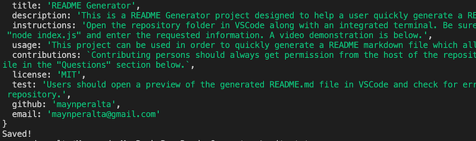

# README Generator
  
  ## Description
  This is a README Generator project designed to help a user quickly generate a README markdown file for projects which require it.  
  
   

  ## Table of Contents
  [**Installation**](#installation) 
  [**Usage**](#usage) 
  [**License**](#license) 
  [**Contributing**](#contributing) 
  [**Tests**](#tests) 
  [**Questions**](#questions)
   

  ## Installation
  Open the repository folder in VSCode along with an integrated terminal. Be sure the integrated terminal command path is the same as the repository folder. On the terminal command line enter "node index.js" and enter the requested information. A link to a YouTube video demonstration is below. 

  
   

  ## Usage
  This project can be used in order to quickly generate a README markdown file which allows users to spend less time typing one from the ground up and more time on other projects.
   

  ## License
  This project is licensed under MIT 
  License information can be found [here](https://opensource.org/licenses/MIT).
   

  ## Contributing
  Contributing persons should always get permission from the host of the repository's master branch. Any contributors should also include their email and a link to thier personal GitHub profile in the "Questions" section below.
   

  ## Tests
  Users should open a preview of the generated README markdown file in VSCode and check for errors/bugs or anything that needs to be corrected and make corrections/fixes before pushing to the master branch repository. A screenshot of a successfully generated README file is below. The terminal with give the message "Saved!" if the generation was successful 
  
   

  ## Questions
  If you have any questions regarding the project, feel free to reach out to the contributors below:  
  <maynperalta@gmail.com>  
  [GitHub profile](https://github.com/maynperalta)